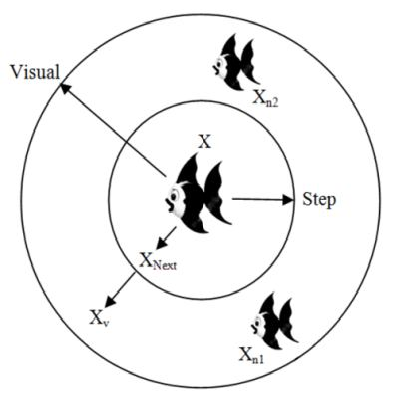
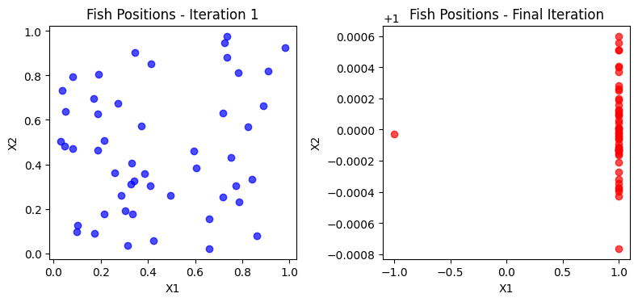

# AFSA-algorithm

SwarmFish -- The Artificial Fish Swarm Algorithm (AFSA)

The Artificial Fish Swarm Algorithm (AFSA) is a population-based optimization method inspired by the social behaviors of fish in nature, such as foraging, clustering, and random swimming. It simulates how fish search for food and maintain group dynamics to explore the search space efficiently. AFSA is well-suited for solving complex optimization problems due to its simplicity, robustness, and ability to avoid local minima through diverse exploration. The algorithm has been applied in fields like engineering, image processing, and machine learning.


<br><br>

<br>
<br><br><br><br>
The complete code of the Artificial Fish Swarm (AFSA) algorithm includes the implementation of all the main fish behaviors (searching, swarming, following and attacking), along with tuning parameters and stopping conditions.
This is the base code for implementing the AFSA algorithm and can be customized and tuned to optimize different functions and more complex problems. This implementation includes all the basic behaviors of AFSA and uses different search methods to find the optimum.


<< this Code is completely based on AFSA papers >>


<p align="center">
<br><br><br><br>

<br>
<b>AFSA First & last Iteration</b>
<br><br><br><br>
</p>


## Run AFSA

To run the AFSA algorithm, execute the following code:
```
def func(x):
    x1, x2 = x
    return 1 / x1 ** 2 + x1 ** 2 + 1 / x2 ** 2 + x2 ** 2


from AFSA import AFSA

afsa = AFSA(func, n_dim=2, size_pop=50, max_iter=300,
            max_try_num=100, step=0.5, visual=0.3,
            q=0.98, delta=0.5)
best_x, best_y = afsa.run()
print(best_x, best_y)


```

## Plot AFSA

To display the positions of the fish in the first and last iterations, run the following code:
```

import matplotlib.pyplot as plt

# First iteration fish positions
positions_start = afsa.history_positions[0]

# Last iteration fish positions
positions_end = afsa.history_positions[-1]

# Plot positions
plt.figure(figsize=(12, 6))

# First iteration
plt.subplot(1, 2, 1)
plt.scatter(positions_start[:, 0], positions_start[:, 1], c='blue', alpha=0.7)
plt.title('Fish Positions - Iteration 1')
plt.xlabel('X1')
plt.ylabel('X2')

# Last iteration
plt.subplot(1, 2, 2)
plt.scatter(positions_end[:, 0], positions_end[:, 1], c='red', alpha=0.7)
plt.title('Fish Positions - Final Iteration')
plt.xlabel('X1')
plt.ylabel('X2')

plt.tight_layout()
plt.show()


```
