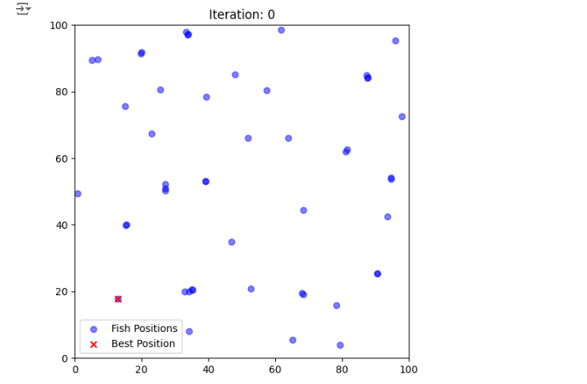

# AFSA-algorithm

SwarmFish -- The Artificial Fish Swarm Algorithm (AFSA)

The Artificial Fish Swarm Algorithm (AFSA) is a population-based optimization method inspired by the social behaviors of fish in nature, such as foraging, clustering, and random swimming. It simulates how fish search for food and maintain group dynamics to explore the search space efficiently. AFSA is well-suited for solving complex optimization problems due to its simplicity, robustness, and ability to avoid local minima through diverse exploration. The algorithm has been applied in fields like engineering, image processing, and machine learning.


<br><br><br><br>
<br><br><br><br>
The complete code of the Artificial Fish Swarm (AFSA) algorithm includes the implementation of all the main fish behaviors (searching, swarming, following and attacking), along with tuning parameters and stopping conditions.
This is the base code for implementing the AFSA algorithm and can be customized and tuned to optimize different functions and more complex problems. This implementation includes all the basic behaviors of AFSA and uses different search methods to find the optimum.


<< this Code is completely based on AFSA papers >>


<p align="center">
<br><br><br><br>

<br>
<b>Figure1: AFSA First Iteration</b>
<br><br><br><br>
</p>

## Run
You can adjust the parameters according to your application. The code provides a visual representation of the position of the fish during execution for better insight into the process. If you want, you can activate this part of the code.

```
python main.py 
```
